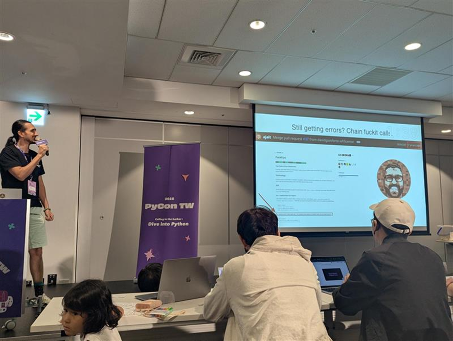

# PyCon TW 2025 カンファレンスレポート

執筆者
- 齊藤優 (さいとうゆう)
- 橘祐一郎（たちばなゆういちろう）
- PyLadies Tokyo 石田真彩（いしだまあや）

目次 (記事の内容)
- [PyCon TW 2025 概要](#pycon-tw-2025-概要)
    - [PyCon TW とは](#pycon-tw-とは)
    - [スケジュール](#スケジュール)
    - [会場の様子](#会場の様子)
- [カンファレンス 1 日目](#カンファレンス-1-日目)
    - [21st Century Sports Analytics and Technology Innovation by Tica Lin (keynote)](#21st-century-sports-analytics-and-technology-innovation-by-tica-lin-keynote)
    - [Panel discussion](#panel-discussion)
    - [Lightning Talks](#lightning-talks)
- [カンファレンス 2 日目](#カンファレンス-2-日目)
    - [CPython Past, Current, and Future by Dongbee Na (Keynote)](#cpython-past-current-and-future-by-dongbee-na-keynote)
    - [Behind the scenes of FastAPI and friends for developers and builders by Sebastian Ramirez (Keynote)](#behind-the-scenes-of-fastapi-and-friends-for-developers-and-builders-by-sebastian-ramirez-keynote)
    - [Lightning Talks](#lightning-talks-1)
    - [Closing](#closing)
- [PyCon TW 2025 コラム](#pycon-tw-2025-コラム)
    - [コラム①：PyCon TW AI Notebook](#コラム①pycon-tw-ai-notebook)
    - [コラム②：乖乖](#コラム②乖乖)
    - [コラム③：あつまれ! PyLadies!](#コラム③-あつまれ-pyladies)
- [まとめ](#まとめ)

こちらは PyCon TW 2025 の参加レポートになります。PyCon TW 2025 は 2025 年 9 月 5 日から 7 日にかけて台湾の台北で実施されました。

# PyCon TW 2025 概要
## PyCon TW とは
PyCon TW は、台湾で開催される Python コミュニティのイベントです。地元の有志メンバーによる自主運営で開催されており、台湾のさまざまな分野で Python を活用するエンジニア、研究者、学生、企業関係者などが集います。参加者は、経験や最新技術の情報交換を行いながら、台湾コミュニティ独自の熱意や交流を体感できるイベントです。

## スケジュール
PyCon TW 2025 のイベント概要は以下の通りです。
|項目|内容|
|---|---|
|URL|https://tw.pycon.org/2025/en-us|
|スプリント日程|2025 年 9 月 5 日 (金)|
|カンファレンス日程|2025 年 9 月 6 日 (土⁠)⁠~ 7 日 (日)|
|場所|台湾 (台北)|
|会場|Taipei New Horizon|
|参加費|NT$ 3,490（約 17,000 円）|

## 会場の様子
会場は臺北文創という建物の 6 階でした。台湾のメインステーション駅から板南線 (青色の路線) で 5 駅なのと、駅から徒歩 9 分の立地の会場だったので、非常にアクセスが良い場所でした。

臺北文創の建物の様子 (個人的には建物への入口が少しわかりづらかったです)

会場内の雰囲気はこちら

トークは基本的には R0 から R4 の 5 トラックで並行して実施されました。また、それに加えてスプリントやチュートリアル用の部屋も用意されていました。

R0 はキーノートやパネルディスカッションなどが実施され、今回の 5 つの部屋の中では最も大きな部屋になります。R1 ~ R4 の部屋ではその他のトークが行われ、広さはそれぞれ同じです。また、キーノート数は 3 つあり、2 つが英語での実施、1 つが中国語での実施となりました。さらにトーク数は合計で 35 であり、その内 15 が英語でのトーク、20 が中国語でのトークとなりました。

# カンファレンス 1 日目
## 21st Century Sports Analytics and Technology Innovation by Tica Lin (keynote)

初日の基調講演は、ハーバード大学でコンピューターサイエンスの博士号を取得し、NBA フィラデルフィア 76ers のデータ分析チームでも活躍された Tika Lin さんによる「21 世紀のスポーツデータ技術とイノベーション」でした。
近年、スポーツ業界では選手や試合の膨大なデータを収集・分析し、チーム戦略や選手育成、ファン体験に活用する流れが加速しています。Tika さんは、プロスポーツチームでの実際の経験を踏まえ、NBA でのカメラや光学トラッキングによるデータ取得、分析チームによる選手評価やトレード判断の仕組み、そして現場で活用されるダッシュボードやレポートの工夫について紹介されました。特に「人間中心設計」が重要であり、現場スタッフやコーチの理解・納得を得ながら段階的にテクノロジーを浸透させていく必要性を強調していました。

また、AR/VR やコンピュータビジョン、AI を使ったトレーニングやファン向けサービスなど、Python 技術がスポーツ分野で幅広く応用されている事例も紹介され、今後ますますデータ活用が進むことが予想されました。
質疑応答では、現場とのコミュニケーションや技術導入の難しさに関する質問が多く、「一度に自動化するのではなく、段階的に現場の声を聞きながら進めることが大切」と回答していました。
スポーツ×データ× AI の最前線と、現場視点の課題解決の実践例が詰まった、非常に学びの多いセッションでした。

## Panel discussion
1 日目のパネルディスカッションでは、「AI 時代のキャリアとコミュニティ」をテーマに、AI・機械学習・オープンソース分野で活躍する 4 名のパネリストが登壇しました。Python 本体開発、スポーツ科学、業界応用、そして FastAPI 開発などバックグラウンドの異なるメンバーによる多角的な議論となりました。

冒頭、米国の求人データを例に「ソフトウェアエンジニアの需要が減少している」という話題が提示され、これからのキャリア形成について意見が交わされました。パネリストからは「単なるコーディング能力だけでなく、どんな分野・課題に興味や情熱を持ち、製品やサービスとして社会に価値を生み出せるかが重要」「AI ツールを活用することで、個人の力でもより大きな成果を出せる可能性がある」といった前向きなアドバイスが出ていました。
また、AI エージェントによる開発（バイブコーディング）の普及と課題についても議論され、「AI がコードを書く時代でも、問題解決の力、デバッグ力、そして自分で学び続ける姿勢が不可欠」「AI に明確なコンテキストや要件を与えて協調するスキルが求められる」といった現場感のあるコメントが印象的でした。
(中には vibe coding に対してこうした厳しい意見もありました。)

コミュニティ運営やオープンソースの支援については、「AI 企業のスポンサーシップが減る中でも、特定の課題に焦点を当てた開発や、現場からのフィードバックを大切にすることが、持続的な成長に繋がる」という意見があり、今後の Python エコシステムやコミュニティ活動の在り方についても活発な意見交換が行われました。
質疑応答では、「AI 時代のジュニア・シニアエンジニアの役割の違い」「5 年後の AI の課題」など、参加者のリアルな不安や関心が投げかけられ、パネリストは「失敗や知らないことを恐れず、粘り強く学び続けることが大切」とエールを送っていました。
AI 技術の進展がキャリアや開発現場、コミュニティの在り方にどのようなインパクトを与えるか、実践的かつ多面的な視点で学べるセッションでした。

## Lightning Talks
今年のライトニングトークは持ち時間 3 分、7 本のトークがテンポ良く進行しました。多彩な話題が展開され、技術ネタからコミュニティ・イベント紹介まで幅広い内容で盛り上がりました。

技術系では、「船酔いセルフレスキューガイド」や「誰も喜ばない Python コード」など、ユーモアを交えた実践 Tips やライブコーディングも登場。失敗談や「GPT に頼りすぎず批判的思考を持つべき」といった現実的なアドバイスもあり、参加者から共感を呼んでいました。
コミュニティ紹介枠では、PyCon Indonesia や読書クラブ、台湾南部のテックコミュニティなど、各地の Python 関連イベント・活動の最新情報がシェアされました。海外 PyCon への参加を呼びかける熱いメッセージもあり、国際的なつながりが感じられる時間でした。

また、アニメキャラクターと Python コードの関係や、PyLadies のグローバルイベント紹介など、文化や多様性を感じるトークも印象的でした。短い持ち時間ながら個性と情熱あふれる発表が続き、会場は終始和やかな雰囲気に包まれていました。
ライトニングトークは、「技術」「コミュニティ」「多様性」を体感できる、PyCon ならではのセッションだと改めて感じました。

# カンファレンス 2 日目
## CPython Past, Current, and Future by Dongbee Na (Keynote)

カンファレンス 2 日目の基調講演は、Safe Python のコア開発者であり、今年から Python 運営評議会にも名を連ねる Donghee さんによる「C Python の過去・現在・未来」についてのトークでした。C Python のパフォーマンスや安定性向上に取り組みつつ、APEC 地域でのコミュニティ活動も積極的に推進されている方ということで、今の Python エコシステムを牽引する立場のひとりです。
トークではまず、Python が AI 時代において世界的に重要な言語となった今、より多くの責任を担う必要があるという話が印象的でした。C や Rust、Java といった他言語と比較した時のパフォーマンスの違いや、なぜ Python が遅いのかという根本的な疑問に触れながら、インタプリタの仕組みや参照カウントの課題など、内部構造を分かりやすく説明してくれました。歴史的にも様々な高速化プロジェクト（PyPy や Google、Dropbox、Instagram など）の取り組みが紹介され、互換性やリソース不足など、理想と現実のギャップも率直に語られていたのがとてもリアルでした。

ここ数年で特に進化が著しいのは、Microsoft やコミュニティ主導の最適化プロジェクトによる、バイトコードインタプリタやランタイムの改良です。純粋な Python コードの実行速度向上や、今後のフリースレッド化（GIL 廃止）に向けたチャレンジについても、実際にどれだけ難しいか・どうやって進めているか、コア開発者目線で丁寧に語られていました。Q&A では、企業主導とコミュニティ主導のプロジェクトのメリット・デメリット、GIL の課題、JIT や仮想スレッドなど未来の話題まで多岐にわたり、会場からもたくさんの質問が飛び交っていました。
私自身、Python の高速化や内部構造についてはなんとなく知っているつもりでしたが、Donghee さんの話を聞いて「コミュニティの努力や歴史が今の Python につながっているんだな」と改めて実感しました。今後も進化していく Python の姿を、開発者だけでなくユーザーみんなで見守り、支えていきたいと思える素敵なセッションでした。

## Behind the scenes of FastAPI and friends for developers and builders by Sebastian Ramirez (Keynote)

カンファレンス 2 日目の最後の基調講演は、FastAPI の開発者であるセバスチャン・ラミレス（Tiangolo）さん「FastAPI と開発者とビルダーの仲間たちの舞台裏」についてのトークで、開発者としてのリアルな経験と、FastAPI や関連ツールの誕生・発展の舞台裏について話されました。
セバスチャンさん自身が「何より問題解決を最優先する」というスタンスを強調していたのが印象的でした。革新や"すごいもの"を作ることよりも、自分やチームが本当に困っていることにフォーカスし、それを解決するプロダクトやオープンソースを生み出してきたという話には、とても共感しました。FastAPI の開発も「自分が欲しかったものを作った」というシンプルさが原点で、世界中で使われるまでに成長した今でも、その姿勢は変わらないようです。
また、ユーザー（特に初心者）の視点を大事にし、ドキュメントの整備や型アノテーションによる開発体験の向上、情報の重複や命名の一貫性など、細やかな工夫や"ちょっとした努力"を惜しまない姿勢は、プロダクトを長く愛されるものにする秘訣だと感じました。実際、FastAPI のドキュメントやコミュニティ運営は、国際的なボランティアの力によって支えられている部分も大きいそうで、「誰もが貢献できる」オープンソースの魅力も改めて感じることができました。

Q&A では、Pydantic v1 から v2 への移行時の苦労や、コミュニティの質問対応、メンテナンス体制、スポンサーシップや持続可能性についても率直に語られていて、成功の裏側の"人間くささ"も垣間見えました。大規模プロジェクトを維持する難しさはあるものの、「自分もたくさんコーヒーを消費する」というユーモアや、苦いフィードバックへの向き合い方も含めて、開発者としての等身大のメッセージが響きました。
「シンプルなものを作るには実は多くの努力がいる」という言葉が心に残りました。FastAPI のような世界的プロジェクトの裏側には、地道な工夫やユーザー目線の積み重ねがあることを学べる、とても良いセッションでした。

## Lightning Talks
クロージング前のライトニングトークは、今年も個性豊かな発表が次々と繰り広げられていました。持ち時間はほんの数分ですが、その短さを活かして、ユニークなテーマや実践的な小ネタが連発されるのがこのコーナーの醍醐味だと感じました。

最初のスピーカーは、謎の "F**k it" パッケージについて語られました。デコレータやコンテキストマネージャを使うだけでエラーを握りつぶせる（!?）というブラックジョーク的な内容で、まさに「やりたいことをやるためのライセンスがあれば使える」スタンス。思わず会場もくすりと笑ってしまうトークで、こういう"攻めた"ネタが出てくるのもライトニングトークならではだなと感じました。

続いて、台湾で活動するデジタルノマドコミュニティの紹介や、台北の天気データを Python と pandas で分析する話、PyCon 香港や韓国の新しいオープンソースカンファレンスの告知など、国際色豊かな話題も多く、コミュニティ同士のつながりや情報交換の場としての役割も感じました。
さらに、AI を活用した天文探査アプリの作り方や、Python でのストリーム処理の Tips など、実用的な内容から技術的な話題までバラエティに富んだラインナップ。短い時間でも「これ、試してみたい！」と思えるアイデアが詰まっているのが面白かったです。
ライトニングトークは、真剣な技術議題だけでなく、ちょっとした笑いや交流、告知など、PyCon らしい"人の輪"を感じられる時間。来年もどんなネタが飛び出すか、今から楽しみです。

## Closing

今年のクロージングセッションでは、運営チームが 2 日間のイベントを振り返り、参加者分析やプログラムの舞台裏、準備期間のエピソードなどを共有してくれました。特に、100 名以上のボランティアや多様なスポンサー、海外からの参加者が支えていたことが強調され、会場全体にコミュニティの一体感が広がっていました。

抽選会や記念撮影では、参加者同士の交流や笑顔があふれ、ボランティア・スポンサー・各運営チームへの感謝のメッセージも丁寧に伝えられていました。最後には「来年もぜひ参加を」といった前向きな言葉があり、温かい雰囲気の中でイベントの幕が閉じました。

# PyCon TW 2025 コラム
## コラム①：PyCon TW AI Notebook
これは、リアルタイム文字起こし機能と、中国語、英語、日本語への翻訳機能を持つ AI ツールで、今回の PyCon TW で私が大変お世話になったツールです。こちらは PyCon TW の有志からなる運営の開発チームが用意したもので、シンプルで使いやすく、ツールとしての出来が良いと感じました。
こちらは、実際に日本語への翻訳機能を使った画面になります。

PyCon TW の概要でも書きましたが、参加者ほぼ全員が聴講するキーノートのうち 1 つが中国語で実施され、トークに関しては半分以上が中国語だったため、中国語がわからない人からすればほぼ必須のツールだったと言えます。PyCon TW の運営さん、ご配慮本当にありがとうございました。

## コラム②：乖乖
PyCon TW 2025 に参加してきました。その際に台湾の**乖乖**（Kuai Kuai/Guai Guai）というお菓子について面白いカルチャーを知ったので紹介します。

遡って PyCon TW の半年ほど前、2 月に東京で開催された [Open Source Conference](https://event.ospn.jp/osc2025-spring/)（OSC）で、たまたま台湾の OSS カンファレンス、[COSCUP](https://coscup.org/) のブースに立ち寄りました。その運営メンバーが台湾から来ていて、 台湾の乖乖というスナックをお土産に配っていました。IT 機器の近くに、このスナックを壊れないための"お守り"として置いておくのが台湾の文化なのだと教えてもらいました(※)。

<!-- 自宅PC横の乖乖 -->

(※): 日本にもサーバーがけしからんことにならないように[お供えをする例](https://telework.cyber.ipa.go.jp/news/20201103/)がありますが、どうやら台湾の乖乖はもっとカジュアルに一般に浸透したもののようです。

そして賞味期限が切れたらお守りの効果も切れるから、それまでに台湾に買いに来て更新してね、とのことでした。今回の PyCon TW 参加はちょうど良い機会です！（本来は COSCUP へまず行くべきだったのでしょうが…。）貰った乖乖は家の PC の横に置いて、教わった通りお守りにしてありましたが、台湾渡航前日に食べ（ココナッツ風味でおいしい😋）、新しい乖乖を買うために（？）台湾に出発しました。

到着して探してみると台湾のどのコンビニでも売っていて、すぐに買えました。

_コンビニで売っている乖乖。お守りには緑色を買うこと！_

…というような話を PyCon TW 参加者の Discord チャンネルに書いたところちょっと盛り上がり、運営メンバーの目に留まって会のオープニングトークに乖乖の紹介が挟まったりしました。

また OSC で乖乖をくれた COSCUP の方が PyCon TW でもブースを出していて再会できました。乖乖を買いにきたよ！と会話のきっかけができました。

今回の PyCon TW では[トークをした](https://tw.pycon.org/2025/en-us/conference/talk/340)のですが、その時に司会をしてくれた PyCon TW の方からお土産をもらいました！これも乖乖ですが、台東の方でだけ買える限定版だそうです。パッケージが赤いので機械のそばに置いたらむしろ壊れるよと言われたので、お守りとしては使わず気兼ねなく食べてしまおうと思います。

また、会期後に観光していてふらっと入ったカフェのレジにも乖乖が置いてありました。IT 業界だけでない一般的な習慣（？）のようです。
ちなみにパッケージ前面にお守りの対象を書ける欄があります。このレジの乖乖には書いてありますね。

台湾に行ったらぜひ乖乖を買って、壊れない IT 環境を手に入れてください。
私は来年も PyCon TW か COSCUP に参加して新しい乖乖に更新しなければなりません。

ちなみにあとで調べたら日本語版 Wikipedia に記事がありました:
[台湾における乖乖文化, Wikipedia](https://ja.wikipedia.org/wiki/%E5%8F%B0%E6%B9%BE%E3%81%AB%E3%81%8A%E3%81%91%E3%82%8B%E4%B9%96%E4%B9%96%E6%96%87%E5%8C%96)

参加者のチャットではこちらの記事が貼られていました: [The 'good luck' snack that makes Taiwan's technology behave, BBC](https://www.bbc.com/worklife/article/20210414-the-good-luck-snack-that-makes-taiwans-technology-behave)

## コラム③: あつまれ! PyLadies!
[PyLadies Tokyo](https://tokyo.pyladies.com)
運営メンバーの 1 人、まーや([@maaya8585(https://x.com/maaya8585))です。    
今年の PyCon TW は、"PyLadies Event" というアクティビティが day1 の 14 時から Sprint ルーム (自由にテーマを持ち寄って議論することができるフリーディスカッションルーム) で開催されました。    

[PyCon US](https://gihyo.jp/list/group/PyCon-US-2025参加レポート#rt:/article/2025/06/pycon-us-2025-01) や [PyCon JP](https://2025.pycon.jp) などではよく PyCon イベント内で PyLadies アクティビティが開催されていますが、実は PyCon TW では初の試み。そんな素敵なタイミングに運良く参加出来ましたのでレポートします。    

台湾には [PyLadies Taiwan](https://tw.pyladies.com/) という、PyLadies Tokyo よりもさらに長く活動している PyLadies 支部があります。PyLadies Taiwan のメンバー、および今回の PyCon TW に参加していた議論の結果、今回の PyLadies Event では「スピーカーになるには？」というテーマでプレゼンテーション及びディスカッションをすることにしました。    

PyLadies Event には 15 ～ 20 名くらいの方が集まりました。もちろん誰でも参加できるイベントですので、女性だけではなく男性もちらほら参加されてました。最初にスピーカーになるために、どんなテーマをどう話せばいいのかなどのアイデアの共有がされ、その後ディスカッションを行いました。イベントでスピーカーになることに対して漠然とした不安や劣等感を感じている方は少なくないようで、こういった思いを持つ人の比率などはもしかしたら日本と台湾でわりと近いのかもしれないなと感じました。    

PyCon TW 2025 には奇跡的にも (?) PyLadies Taiwan のメンバーだけでなく、PSF (Python Software Foundation) board メンバーの 1 人である Cheuk Ting Ho さんをはじめ、[PyLadies Seoul](https://pyladies.kr/ko/)、PyLadies Tokyo などアジア各国から PyLadies のオーガナイザーが参加していました。それぞれの経験や各国の状況などの意見交換も活発に行われ、とても良い雰囲気で記念すべき第 1 回の PyLadies Event の幕を閉じました。    

    

day1 午後に本アクティビティがあったことから、day1 後の PyNight や day2 のイベント中にも PyLadies Event に参加していた方々と何度も交流することができ、すごくよい時間をすごせました。    

# まとめ
PyCon TW 2025 に参加してみて、Python への関心を深めるだけではなく、様々な学びを得られた体験になりました。AI 時代におけるエンジニアの在り方について考えさせられたり、CPython や FastAPI の開発者から直接話を聞けたことで、オープンソースへの理解と関心が一層深まりました。台湾の乖乖文化や AI Notebook のような細やかな配慮、PyLadies Event での温かい交流など、技術を通じた人と人との繋がりの素晴らしさも実感しました。言語の壁を超えて共有できる Python への情熱や、コミュニティの持つ人の温かさを実感し、来年もぜひ参加したいと思える貴重な経験となりました。
